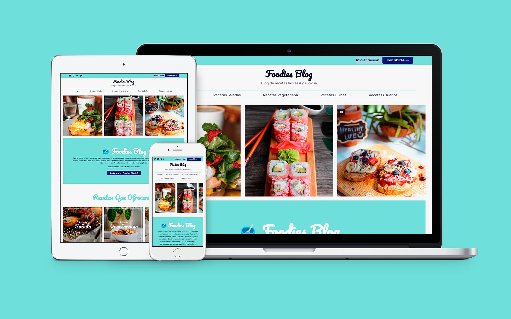

## ✨Project preview

<h1 align=center>🥣 Foodies Blog</h1>

<h3 align="center">This was constructed using modern technologies:</h3>

    
    
    
    
    
    
    

 

 

🌐The online site: <a href="https://foodies-blog-app.onrender.com" target="_blank">🥣 Foodies Blog</a>

 
